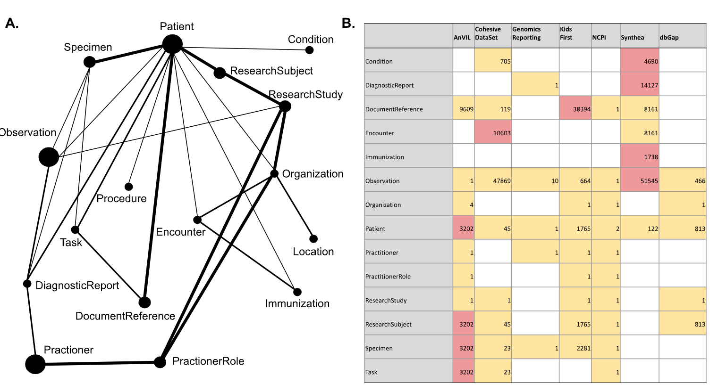

# iceberg-schema-tools
Create and maintain central iceberg schema.  Render and validate FHIR data.

## Overview




Code that generates the base schema from FHIR goes here.  Additional tools are provided to lints, validates and visualize the schema.

Note: The actual schemas are stored in [iceberg](https://github.com/bmeg/iceberg)


## Setup

```
pip install iceberg-tools
```


## Use

```
$ iceberg schema
Usage: iceberg schema [OPTIONS] COMMAND [ARGS]...

  Manage bmeg or gen3 schemas from FHIR resources.

Options:
  --help  Show this message and exit.

Commands:
  generate  Generate from FHIR resources.
  compile   Create aggregated json file from individual yaml schemas
  publish   Copy dictionary to s3 (note:aws cli dependency)

$ iceberg data

Usage: iceberg data [OPTIONS] COMMAND [ARGS]...

  Project data (ResearchStudy, ResearchSubjects, Patient, etc.).

Options:
  --help  Show this message and exit.

Commands:
  simplify       Renders Gen3 friendly flattened records.
  validate       Check FHIR data for validity and ACED conventions.
  validate-gen3  Check Gen3 data for validity and ACED conventions.
  pfb            Write simplified FHIR files to a PFB.
  migrate        Migrate from FHIR R4B to R5.0.

```

> Note: `pfb_fhir` and `iceberg` are synonymous in this context.

## Examples

The commands:
```commandline
pfb_fhir data simplify  tests/fixtures/simplify/study/ tmp/simplified
pfb_fhir data pfb tmp/simplified/ tmp/study.pfb
tree tmp

```

Will generate the following output:
```commandline
INFO:'Records with relationships': 59413
INFO:'Records': 59460
tmp
├── simplified
│   ├── Condition.ndjson
│   ├── DocumentReference.ndjson
│   ├── Encounter.ndjson
│   ├── MedicationAdministration.ndjson
│   ├── Observation.ndjson
│   ├── Patient.ndjson
│   ├── ResearchStudy.ndjson
│   ├── ResearchSubject.ndjson
│   ├── Specimen.ndjson
│   └── Task.ndjson
└── study.pfb

```

## Contributing
See [CONTRIBUTING.md](docs/CONTRIBUTING.md) for developer notes.
