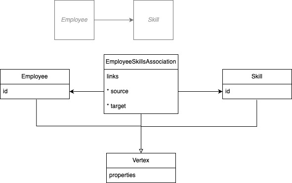

# Link Data Object

## Description
This document specifies a vocabulary for annotating JSON documents with hyperlinks.

Specifically, the use case described here centers around describing a `graph` using hyperlinks.


## Background

Readers are encouraged to `read` the following documents to understand the context of this document.

> A Link Description Object (LDO) is a serialization of the abstract link model defined in RFC 8288, section 2. As described in that document, a link consists of a context, a relation type, a target, and optionally target attributes. JSON Hyper-Schema's LDO provides all of these, along with additional features using JSON Schema to describe input for use with the links in various ways.   See https://json-schema.org/draft/2019-09/json-schema-hypermedia.html#ldo

Also, please read the reference schema
> The URI of the normative link description schema is: <https://json-schema.org/draft/2019-09/links#>.

## The `Graph` Use Case

A graph is composed of nodes and edges. A node is a JSON object. An edge is a JSON object that has a `source` and a `target` node.


A graph ETL process can be described as a series of steps that transform a source graph into a target graph.
The link data object can be used to describe and edge between the source vertex and the target vertex.
In most cases, the link data object will be found in the `links` of the source JSON object.

In some cases, there may be a need to describe a link between two JSON objects that have no implicit knowledge of each other.
In this case, the link data object can be found in the `links` of a third JSON object that has implicit knowledge of both the source and target JSON objects. See `association` below.


## The `Link Data Object` Specification adapted for the `Graph` Use Case

### `rel` and `targetSchema`

See https://json-schema.org/draft/2019-09/json-schema-hypermedia.html#rel

A [common set of link relations](https://www.iana.org/assignments/link-relations/link-relations.xhtml) (like first, next, previous, etc.) has been standardized by IANA.

We will use the `rel` field to describe the `label` of edge between two nodes.

The type of the target node is described in the `targetSchema` field.
A key to provide a schema that defines the link target.

#### Example

A Specimen is a type of vertex. A Patient is a type of vertex. A Specimen is related to a Patient by the `subject` relationship.

```
(Specimen)-subject->(Patient)
```

```yaml
Specimen:
  links:
  - rel: subject
    targetSchema:
      $ref: Patient
```

Ok, so we have a link between a Specimen and a Patient.

But a specimen can come from other entities other than patient:  from a location (e.g., the source of an environmental sample), or a sampling of a substance, a biologically-derived product, or a device.

How would we describe these relationships?

We would use the `rel` field to describe the `label` of edge between two nodes, adding a `_<Type>` suffix.  The type of the target node is also differentiates the `targetSchema` field.

```
(Specimen)-subject_Patient->(Patient)
(Specimen)-subject_Group->(Group)
(Specimen)-subject_Device->(Device)
(Specimen)-subject_Substance->(Substance)
(Specimen)-subject_Location->(Location)
(Specimen)-subject_Location->(BiologicallyDerivedProduct)
```

```yaml
Specimen:
  links:
  - rel: subject_Patient
    targetSchema:
      $ref: Patient.yaml
  - rel: subject_Group
    targetSchema:
      $ref: Group.yaml
  - rel: subject_Device
    targetSchema:
      $ref: Device.yaml
  - rel: subject_BiologicallyDerivedProduct
    targetSchema:
      $ref: BiologicallyDerivedProduct.yaml
  - rel: subject_Substance
    targetSchema:
      $ref: Substance.yaml
  - rel: subject_Location
    targetSchema:
      $ref: Location.yaml
```

### `href`

So now we know the type of the target node, but we don't know where to find it.

The `href` field is used to describe the location of the target node [see more.](https://json-schema.org/draft/2019-09/json-schema-hypermedia.html#href)

### `templatePointers`

The `templatePointers` field is used to describe the location of the target node within the source node.  The schema writer can use this json pointer to retrieve the template variables from the vertex body.

> * The value of the "templatePointers" link description property MUST be an object.
> * Each property value in the object MUST be a valid JSON Pointer

See [more](https://json-schema.org/draft/2019-09/json-schema-hypermedia.html#rfc.section.6.4.1)

#### Example

```
(Specimen{id:"s1")-subject_Patient->(Patient{id:1})
(Specimen{id:"s2")-subject_Group->(Group{id:1})
```

Implementation:
* No new overrides of the link description schema apply.  The vocabulary for the edge association use case is defined in the [targetHints object](https://json-schema.org/draft/2019-09/json-schema-hypermedia.html#rfc.section.6.5.5) .
* By leveraging the template URI nature of href, we support a variety of vertex identifiers.  From the [hypermedia specification](https://json-schema.org/draft/2019-09/json-schema-hypermedia.html#href): "The value of the "href" link description property is a template used to determine the target URI of the related resource."  In our example, we use two different `id` schemes to illustrate this, a relative URL and an uuid.
* The targetHints `multiplicity` label describes the expected `cardinality` of the relationship.  The convention is to use on of ['has_one', 'has_many'] defaults to 'has_many'.
* The targetHints `directionality` label describes the expected `traversal` of the relationship.  The convention is to use one of ['in', 'out'] defaults to 'out'.

Notes for `outbound` traversal:
* the `rel` field is used to name property in the "source" vertex and the `backref` targetHint names the property in the target vertex.


```yaml
Specimen:
  properties:
    subject:
      reference:
  links:
    - rel: subject_Patient
      href: Patient/{id}
      templateRequired:
      - id
      targetHints:
        multiplicity:
        - has_one
        directionality:
        - outbound
        backref:
        - specimen
      templatePointers:
        id: subject/reference
      targetSchema:
       $ref: Patient
    - rel: subject_Group
      href: Group/{id}
      templateRequired:
      - id
      targetHints:
        multiplicity:
        - has_one
        directionality:
        - outbound
        backref:
        - specimen
      templatePointers:
        id: subject/reference
      targetSchema:
        $ref: Group
    # - rel: subject_Device
    # - rel: subject_BiologicallyDerivedProduct

```

**Note**:

* JSON document writers must disambiguate polymorphic references.
* A FHIR specimen's full complement of links: ['additive', 'authorReference_Organization', 'authorReference_Patient', 'authorReference_Practitioner', 'authorReference_PractitionerRole', 'authorReference_RelatedPerson', 'collector_Patient', 'collector_Practitioner', 'collector_PractitionerRole', 'collector_RelatedPerson', 'device', 'location', 'parent', 'procedure', 'request', 'subject_BiologicallyDerivedProduct', 'subject_Device', 'subject_Group', 'subject_Location', 'subject_Patient', 'subject_Substance']


```yaml
specimens:
- id: s1
  subject:
    reference: Patient/1
- id: s2
  subject:
    reference: Group/1
```

MUST produce:

```yaml
specimens:
- id: s1
  subject:
    reference: Patient/1
  links:
    - rel: subject_Patient
      href: Patient/1
- id: s2
  subject:
    reference: Group/1
  links:
    - rel: subject_Group
      href: Group/1

```

## The Association Use Case

Association vertices are used for relationships between two objects. They consist of at least two foreign keys, each of which references one of the two objects.



> The link's relation type identifies its semantics. It is the primary means of conveying how an application can interact with a resource.

In the graph association use case satisfies the following requirements:
* Defines a typed schema for a given association:
* The association is a vertex, an edge with data, which the schema author can define an arbitrary set of properties on the edge.
* When populating the href of an association link, the link writer retrieves the values of template variables from the target vertices.  This differs from [standard hypermedia template processing](https://json-schema.org/draft/2019-09/json-schema-hypermedia.html#rfc.section.7.2.1), where the template variables are retrieved from the instance.

Notes for association use case:
* No naming constraints apply, the schema author can name `rel` values as they see fit to populate a the `backref` of properties in the target vertex.  Useful for graphql or code generation use cases

The targetHints fields that apply to the association use case are:
* the `rel` field is used to describe the `backref` of property in the target vertex.
* the `title` field of the schema is used to describe the `label` of edge between two nodes.
* the `association` indicates that the link is part of an association relationship. Links without this field are "standard" links, that is, they are derived from properties within the vertex


```yaml
"$schema": https://json-schema.org/draft/2020-12/schema
"$id": https://bmeg.io/foo-bar-association
title: FooBarAssociation
properties:
  data:
    type: object
    properties:
      fizz:
        type: string
  links:
    type: array
    items:
      "$ref": https://json-schema.org/draft/2020-12/links

links:
- rel: bar
  href: urn:uuid:{id}
  targetSchema:
    "$ref": Foo
  templatePointers:
    id: /id
  targetHints:
    multiplicity:
      - has_many
    directionality:
      - out
    association:
      - true
- rel: foo
  href: Bar/{id}
  targetSchema:
    "$ref": Bar
  templatePointers:
    id: /id
  targetHints:
    multiplicity:
      - has_many
    directionality:
      - out
    association:
      - true

```

Example instance data:

* An Association instance

```yaml
---
data:
  fizz: buzz
links:
- rel: foo
  href: Bar/9a652678-4616-475d-af12-aca21cfbe06d
- rel: bar
  href: urn:uuid:f81d4fae-7dec-11d0-a765-00a0c91e6bf6

```

* A Foo instance

```yaml
---
id: f81d4fae-7dec-11d0-a765-00a0c91e6bf6
```

* A Bar instance

```yaml
---
id: 9a652678-4616-475d-af12-aca21cfbe06d
```

### Validation

See tests/unit/link-description-object/test_link_description_object_schema.py for examples of validating the schema and instance data.

### Usage

For convenience, the `AssociationInstance` class provides a way to work with the data in the edge.  The `AssociationSchema` class provides a way to work with the schema of the edge.

Exploring instance data on the edge:

```python
from iceberg_tools.graph import AssociationSchema, AssociationInstance

association_schema = AssociationSchema(schema=schema)
association_instance = AssociationInstance(association_schema=association_schema, instance=instance)
expected = 'Foo(f81d4fae-7dec-11d0-a765-00a0c91e6bf6).bar<-FooBarAssociation->Bar(9a652678-4616-475d-af12-aca21cfbe06d).foo'
assert str(association_instance) == expected

```

Creating an instance of the edge from two vertices:

```python
association_schema = AssociationSchema(schema=schema)
association_instance = AssociationInstance(association_schema=association_schema, vertex_a=foo, vertex_b=bar)
expected = 'Foo(f81d4fae-7dec-11d0-a765-00a0c91e6bf6).bar<-FooBarAssociation->Bar(9a652678-4616-475d-af12-aca21cfbe06d).foo'
assert str(association_instance) == expected

```

For applications that need to combine the instance and schema data,
the `AssociationInstance` class provides a `edge_parts` method that can be used to decompose the links
and provide the caller with the composite parts for DB access.

Note that the ['bar', 'foo', 'id'] fields are variable and depend on the schema author's choices for rel and href template names.
This allows for flexibility in the schema author's choice of naming conventions for both relationships and vertex identifiers.


```yaml
---
label: FooBarAssociation
bar:
  id: f81d4fae-7dec-11d0-a765-00a0c91e6bf6
  rel: bar
  targetSchema: Foo
  multiplicity: has_many
  directionality: out
  id_name: id
foo:
  id: 9a652678-4616-475d-af12-aca21cfbe06d
  rel: foo
  targetSchema: Bar
  multiplicity: has_many
  directionality: out
  id_name: id
```

### Edge cases and limitations

JSON Pointer is used to identify the [template variables in the href](https://json-schema.org/draft/2019-09/relative-json-pointer.html#rfc.section.5.1) [RFC](https://www.rfc-editor.org/rfc/rfc6901).
Unfortunately, the JSON Pointer spec does not support iteration.

```text
If the currently referenced value is a JSON array, the reference
      token MUST contain either:

      *  characters comprised of digits (see ABNF below; note that
         leading zeros are not allowed) that represent an unsigned
         base-10 integer value, making the new referenced value the
         array element with the zero-based index identified by the
         token, or

      *  exactly the single character "-", making the new referenced
         value the (nonexistent) member after the last array element.
```

What does that mean for link processing?  It means that the schema author must know the number of template variables in the href.

For example, given this Specimen instance:

```yaml
---
id: s-processing-1
resourceType: Specimen
processing:
- additive:
  - reference: Substance/sub-1
```

The json pointer path for the additive reference is `/processing/0/additive/0/reference`.
The schema author must know that there are two template variables in the path, and that the first variable is the id of the Specimen, and the second variable is the id of the Substance.

What if there are two processing steps?

```yaml
---
id: s-processing-2
resourceType: Specimen
processing:
- additive:
  - reference: Substance/sub-1
- additive:
  - reference: Substance/sub-2

```

The json pointer path for the additive reference is `/processing/0/additive/0/reference` and `/processing/1/additive/0/reference`.

What if there is one processing step with two additives?

```yaml
---
id: s-processing-3
resourceType: Specimen
processing:
- additive:
  - reference: Substance/sub-1
  - reference: Substance/sub-2

```

The json pointer path for the additive reference is `/processing/0/additive/0/reference` and `/processing/0/additive/1/reference`.

### Solution

**How can the schema author provide a consistent way to identify the template pointers?**

Reading further in the json pointer spec we find:

```text
Note that the use of the "-" character to index an array will always
result in such an error condition because by definition it refers to
a nonexistent array element.  Thus, applications of JSON Pointer need
to specify how that character is to be handled, if it is to be
useful.

```

Key phrase: `applications of JSON Pointer need to specify how that character is to be handled`


* We can leverage this to provide a consistent way to identify the template pointers.
* We can consolidate the template pointers into a single pointer, and use the `-` character to indicate an `iterable of unknown length`.

i.e. `/processing/-/additive/-/reference`

In english, this means that the `processing` array is an iterable of unknown length, and the `additive` array is an iterable of unknown length.

#### Implementation

This method will convert a json pointer path into a jq query that can be used to extract the template pointers from the instance data.

```python
def cast_json_pointer_to_jq(_):
    """Convert a JSON pointer to a jq query."""
    return '.' + _.replace('/', '.').replace('.-', '.[]?').replace('.', ' | .')
```

See tests/unit/link-description-object/test_nested_references.py for examples of how this works.

Bindings exist for [GO](https://pkg.go.dev/github.com/itchyny/gojq) and [python](https://pypi.org/project/pyjq/).
