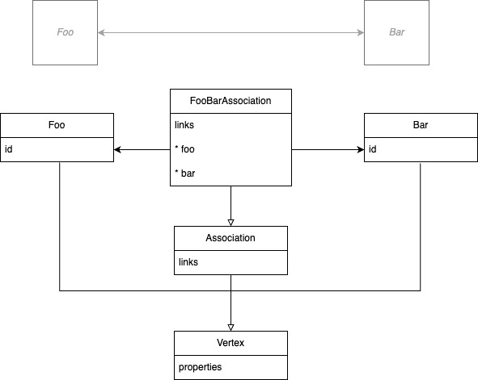

# Link Data Object

## Description
This document specifies a vocabulary for annotating JSON documents with hyperlinks.

Specifically, the use case described here centers around describing a `graph` using hyperlinks.


## Background

Readers are encouraged to `read` the following documents to understand the context of this document.

> A Link Description Object (LDO) is a serialization of the abstract link model defined in RFC 8288, section 2. As described in that document, a link consists of a context, a relation type, a target, and optionally target attributes. JSON Hyper-Schema's LDO provides all of these, along with additional features using JSON Schema to describe input for use with the links in various ways.   See https://json-schema.org/draft/2019-09/json-schema-hypermedia.html#ldo

Also, please read the reference schema
> The URI of the normative link description schema is: <https://json-schema.org/draft/2019-09/links#>.

## The `Graph` Use Case

A graph is composed of nodes and edges. A node is a JSON object. An edge is a JSON object that has a `source` and a `target` node.


A graph ETL process can be described as a series of steps that transform a source graph into a target graph.
The link data object can be used to describe and edge between the source vertex and the target vertex.
In most cases, the link data object will be found in the `links` of the source JSON object.

In some cases, there may be a need to describe a link between two JSON objects that have no implicit knowledge of each other.
In this case, the link data object can be found in the `links` of a third JSON object that has implicit knowledge of both the source and target JSON objects. See `association` below.


## The `Link Data Object` Specification adapted for the `Graph` Use Case

### `rel` and `targetSchema`

See https://json-schema.org/draft/2019-09/json-schema-hypermedia.html#rel

A [common set of link relations](https://www.iana.org/assignments/link-relations/link-relations.xhtml) (like first, next, previous, etc.) has been standardized by IANA.

We will use the `rel` field to describe the `label` of edge between two nodes.

The type of the target node is described in the `targetSchema` field.
A key to provide a schema that defines the link target.

#### Example

A Specimen is a type of vertex. A Patient is a type of vertex. A Specimen is related to a Patient by the `subject` relationship.

```
(Specimen)-subject->(Patient)
```

```yaml
Specimen:
  links:
  - rel: subject
    targetSchema:
      $ref: Patient
```

Ok, so we have a link between a Specimen and a Patient.

But a specimen can come from other entities other than patient:  from a location (e.g., the source of an environmental sample), or a sampling of a substance, a biologically-derived product, or a device.

How would we describe these relationships?

We would use the `rel` field to describe the `label` of edge between two nodes, adding a `_<Type>` suffix.  The type of the target node is also differentiates the `targetSchema` field.

```
(Specimen)-subject_Patient->(Patient)
(Specimen)-subject_Group->(Group)
(Specimen)-subject_Device->(Device)
(Specimen)-subject_Substance->(Substance)
(Specimen)-subject_Location->(Location)
(Specimen)-subject_Location->(BiologicallyDerivedProduct)
```

```yaml
Specimen:
  links:
  - rel: subject_Patient
    targetSchema:
      $ref: Patient.yaml
  - rel: subject_Group
    targetSchema:
      $ref: Group.yaml
  - rel: subject_Device
    targetSchema:
      $ref: Device.yaml
  - rel: subject_BiologicallyDerivedProduct
    targetSchema:
      $ref: BiologicallyDerivedProduct.yaml
  - rel: subject_Substance
    targetSchema:
      $ref: Substance.yaml
  - rel: subject_Location
    targetSchema:
      $ref: Location.yaml
```

### `href`

So now we know the type of the target node, but we don't know where to find it.

The `href` field is used to describe the location of the target node [see more.](https://json-schema.org/draft/2019-09/json-schema-hypermedia.html#href)

The `templatePointers` field is used to describe the location of the target node within the source node.

#### Example

```
(Specimen{id:"s1")-subject->(Patient{id:p1})
```

```yaml
Specimen:
  properties:
    subject:
      reference:
  links:
  - rel: subject_Patient
    targetSchema:
      $ref: Patient
    href: Patient/{id}
    templatePointers:
      - subject/reference
```

**Note**: JSON document writers must disambiguate polymorphic references.

```yaml
specimens:
- id: s1
  subject:
    reference: Patient/1
- id: s2
  subject:
    reference: Group/1
```

MUST produce:

```yaml
specimens:
- id: s1
  subject:
    reference: Patient/1
  links:
    - rel: subject_Patient
      href: Patient/1
- id: s2
  subject:
    reference: Group/1
  links:
    - rel: subject_Group
      href: Group/1

```

## The Association Use Case

Association vertices are used for relationships between two objects. They consist of at least two foreign keys, each of which references one of the two objects.



> The link's relation type identifies its semantics. It is the primary means of conveying how an application can interact with a resource.

In the graph use case:

* the `rel` field is used to describe the `backref` of property in the target vertex.
* the `title` field is used to describe the `label` of edge between two nodes.


### `base` schema property


* Define a base schema

```yaml
---
"$schema": https://json-schema.org/draft/2019-09/schema
#
# The `association` schema is a marker schema used to describe a link between two JSON objects.
#
"$id": https://bmeg.io/association
type: object
additionalProperties: true
properties:
  links:
    type: array
    items:
      "$ref": https://json-schema.org/draft/2019-09/links

```

The association use case satisfies the following requirements:
* Define a typed schema for a given association:
* The association is an edge with data, the schema author can define an arbitrary set of properties
* No naming constraints apply, the schema author can name `rel` values as they see fit to populate a the `backref` of property in the target vertex.
* From the hypermedia spec: "The value of the "href" link description property is a template used to determine the target URI of the related resource."  In our example, we use two different `id` schemes to illustrate this.
* The targetHints "multiplicity" label describes the expected `cardinality` of the relationship.  In our example, we use `one` and `many` to describe the cardinality of the relationship.  The convention is to use on of ['has_one', 'has_many'] defaults to 'has_many'.
* The targetHints "directionality" label describes the expected `directionality` of the relationship.  In our example, we use `in` and `out` to describe the directionality of the relationship.  The convention is to use on of ['in', 'out'] defaults to 'out'.

```yaml
---
"$schema": https://json-schema.org/draft/2019-09/hyper-schema
"$id": https://bmeg.io/foo-bar-association
base: https://bmeg.io/association
title: FooBarAssociation
properties:
  data:
    type: object
    properties:
      fizz:
        type: string
links:
- rel: bar
  href: urn:uuid:{id}
  targetSchema:
    "$ref": Foo
  templatePointers:
  - "/id"
- rel: foo
  href: Bar/{id}
  targetSchema:
    "$ref": Bar
  templatePointers:
  - "/id"
```

Example instance data:

```yaml
---
data:
  fizz: buzz
links:
- rel: foo
  href: Bar/9a652678-4616-475d-af12-aca21cfbe06d
- rel: bar
  href: urn:uuid:f81d4fae-7dec-11d0-a765-00a0c91e6bf6

```


Validating the instance data on the edge:

```python
import jsonschema

# validate schema, inherits schema validation: ie checks data.fizz.buzz

# load schema and instance from yaml above

assert jsonschema.validate(schema=schema, instance=instance) is None, "Instance should have validated"
print("Schema validation of instance: OK")
```

Validating our association schema:

```python
# load schema and instance from yaml above

assert schema['base'] == 'https://bmeg.io/association', "Schema should be an association"

# validate links
assert len(instance['links']) >= 2, "Association should have at least two links"

# verify that all links in instance are found in schema
schema_relationships = [_['rel'] for _ in schema['links']]
for link in instance['links']:
    assert link['rel'] in schema_relationships, f"Instance of this association should have links to {schema_relationships}"

print("Validation of bmeg association: OK")
```

An edge writer would then read the `links` array and create edges between the two nodes.

```python
import re

vertex_a = schema['links'][0]
vertex_b = schema['links'][1]

instance_link = next(iter([_ for _ in instance['links'] if _['rel'] == vertex_a['rel']]), None)
rexp = re.compile(vertex_a['href'].replace('{id}', '(.*)')) # cache me
m = rexp.match(instance_link['href'])
assert m is not None, f"Unable to find id in instance link {instance_link['href']} given schema {vertex_a['href']}"
vertex_a_msg = f"{vertex_a['targetSchema']['$ref']}({m.group(1)}).{vertex_a['rel']}"

instance_link = next(iter([_ for _ in instance['links'] if _['rel'] == vertex_b['rel']]), None)
rexp = re.compile(vertex_b['href'].replace('{id}', '(.*)')) # cache me
m = rexp.match(instance_link['href'])
assert m is not None, f"Unable to find id in instance link {instance_link['href']} given schema {vertex_b['href']}"
vertex_b_msg = f"{vertex_b['targetSchema']['$ref']}({m.group(1)}).{vertex_b['rel']}"

print(f"{vertex_a_msg}<-{schema['title']}->{vertex_b_msg}")

```

which would print:

```
Foo(f81d4fae-7dec-11d0-a765-00a0c91e6bf6).bar<-FooBarAssociation->Bar(9a652678-4616-475d-af12-aca21cfbe06d).foo
```
